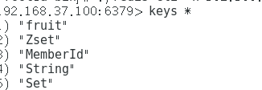

git的问题应该是首先要处理好的

四：关于githup

遇到问题：
一：Navicat for MYSQL

二：虚拟机问题

扩展：
VMware Workstation是VMware公司推出的一款桌面虚拟计算软件。
此软件可以提供虚拟机功能，使计算机可以同时运行多个不同操作系统，
以及进行开发、测试 、部署新的应用程序的最佳解决方案。该软件具有Windows、Linux版本。

三：redis的开启
    linux操作redis命令
        一：前置redis命令  
        二：hash类型数据命令  
        三:有序集合zeset 类型数据命令    
    实际操作结果：
        没存进去之前：  
        存进去之后：  
    各个key的数据类型：  
    总体：  

这是从git上面进行手动修改，然后再让idea拉取过去
